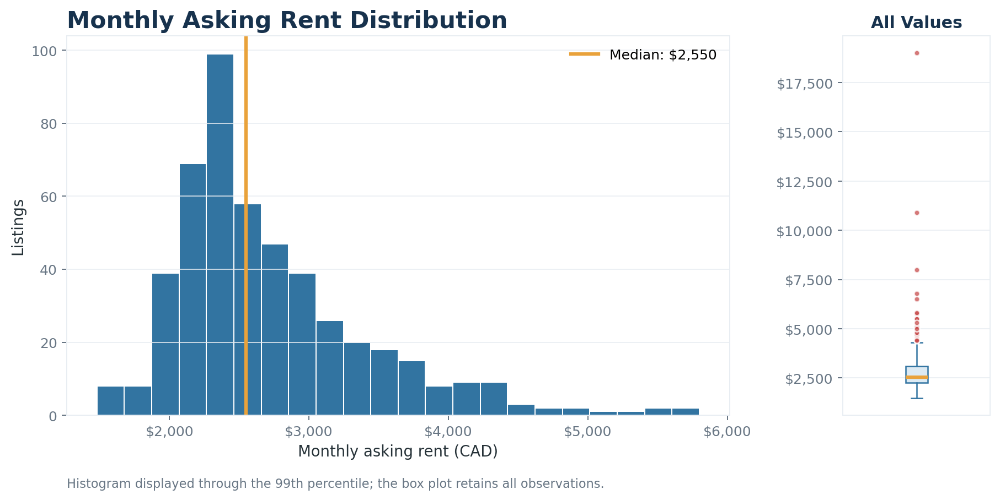
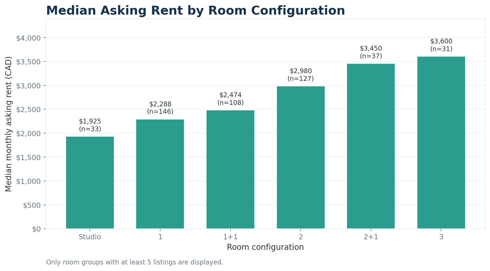
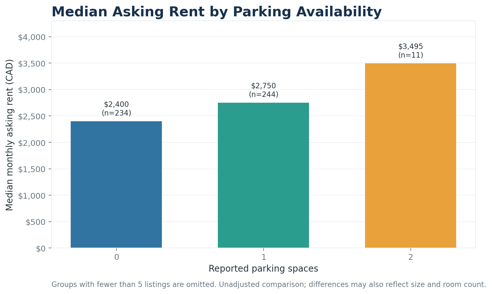
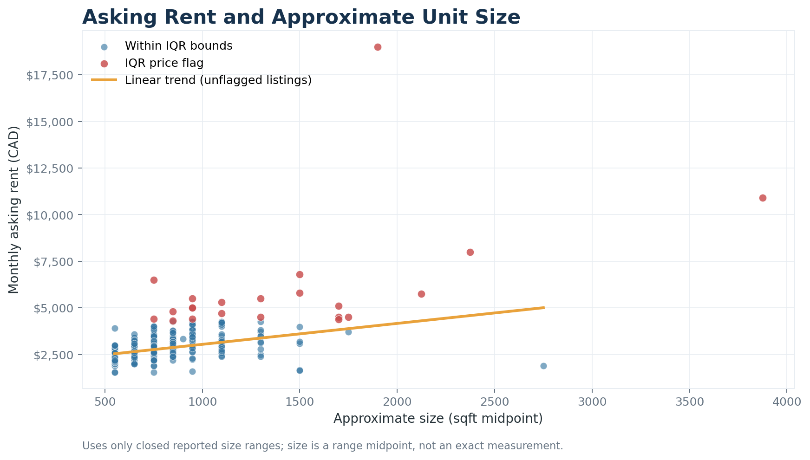
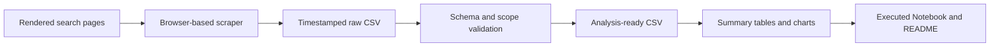

# Toronto Condo Rental Analysis

[](https://www.python.org/)
[](https://www.drissionpage.cn/)
[](https://pandas.pydata.org/)
[](#testing)
[](#project-status)

An end-to-end data project that collects rendered Toronto condo rental
listings, converts semi-structured listing cards into validated records, and
analyzes how asking rent varies with room configuration, parking, and
approximate unit size.

The project demonstrates browser-based data collection, defensive parsing,
data-quality controls, automated testing, reproducible analysis, and
portfolio-ready communication.

> **Latest validated snapshot:** 10 search-result pages collected on
> July 25, 2026, producing 492 unique listings and 490 analysis-ready records.

## Project Status

| Component | Current status |
|---|---|
| Chromium-based scraper | Implemented and validated |
| Controlled collection test | 10 pages, 492 unique listings |
| Cleaning and quality controls | Implemented |
| Automated tests | 18 passing |
| Reproducible analysis | Implemented |
| Portfolio charts | 4 generated and versioned |
| Executed analysis Notebook | Complete |
| Dedicated project repository | Complete |

## Key Results

The latest analysis uses 490 whole-unit listings retained after deterministic
scope and quality rules.

| Metric | Result |
|---|---:|
| Analysis-ready listings | 490 |
| Median asking rent | $2,550/month |
| Mean asking rent | $2,803/month |
| Middle 50% of asking rents | $2,250–$3,088/month |
| Median approximate size | 649.5 sqft |
| Median asking rent per sqft | $3.91 |
| Listings with closed size ranges | 407 |
| Open-ended size ranges | 83 |
| IQR price flags retained for review | 22 |

### Asking-rent distribution

The distribution is right-skewed. A small number of high-price listings pull
the mean above the median, so the median and interquartile range provide a
better description of the typical listing in this snapshot.



### Rent by room configuration

Median asking rent increases across the well-represented room categories:

| Room configuration | Listings | Median rent |
|---|---:|---:|
| Studio | 33 | $1,925 |
| 1 bedroom | 146 | $2,288 |
| 1 bedroom + den | 108 | $2,475 |
| 2 bedrooms | 127 | $2,980 |
| 2 bedrooms + den | 37 | $3,450 |
| 3 bedrooms | 31 | $3,600 |



### Rent by reported parking

Listings reporting one parking space had a median asking rent of $2,750,
compared with $2,400 for listings reporting none. This is an unadjusted
comparison rather than a causal estimate of the value of parking; size,
location, room count, and building characteristics may also differ.



### Rent and approximate unit size

For listings with closed size ranges, the analysis uses the reported range
midpoint as an approximation. After excluding IQR price flags from the
correlation calculation, approximate size and asking rent have a Pearson
correlation of 0.45.



For the full walkthrough, assumptions, tables, and interpretation, open the
[executed analysis Notebook](notebooks/01_toronto_rental_analysis.ipynb).

## Project Objectives

- Build a reproducible workflow for collecting Toronto condo rental listings.
- Parse and standardize price, room, bathroom, parking, and floor-area fields.
- Preserve raw values and source text for traceability.
- Reject contaminated page-level or comparison containers.
- Separate data acquisition, cleaning, analysis, and presentation concerns.
- Make quality decisions transparent instead of silently deleting anomalies.
- Present the work as a maintainable data analytics portfolio project.

## End-to-End Workflow



### 1. Data collection

The original static HTTP approach now receives a Cloudflare `403` response.
The current collector therefore uses `DrissionPage` to open rendered public
search-result pages in a visible Chromium browser.

For every requested page, the scraper:

1. Opens the Toronto rental result page in Chromium.
2. Waits for listing cards to render.
3. Locates individual cards from their address elements.
4. Extracts price, room, bathroom, parking, and reported size.
5. Requires exactly one MLS identifier for each accepted card.
6. Verifies that the parsed address belongs to the same card text.
7. Records rejected containers separately for review.
8. Deduplicates accepted listings by source URL.
9. Writes a checkpoint after each successfully processed page.
10. Saves a timestamped raw CSV when collection finishes.

The scraper does not attempt to automate around verification challenges. If
the source site presents one, collection stops for manual review.

### 2. Cleaning and quality controls

`src/clean_data.py` validates the raw schema and creates explicit quality and
analysis-scope fields.

The cleaning stage:

- standardizes strings, numeric values, and UTC timestamps;
- removes exact and source-URL duplicates;
- excludes room-only, shared-accommodation, lower-level, parking-only, and
  locker-only records from the whole-unit analysis;
- retains open-ended size bands without inventing a midpoint;
- calculates approximate size and rent per sqft only for closed size ranges;
- flags price outliers using the 1.5 × IQR rule; and
- exports analysis-ready, excluded-record, and quality-summary files.

### 3. Analysis and presentation

`src/analyze.py` generates reusable summary tables and four publication-ready
charts. The executed Notebook combines those results with interpretation,
limitations, and next steps without duplicating the underlying pipeline logic.

## Data Quality Results

The controlled 10-page run produced 540 page appearances before URL
deduplication.

| Quality check | Result |
|---|---:|
| Unique accepted listings | 492 |
| Rejected comparison container | 1 |
| Exact duplicate rows after processing | 0 |
| Duplicate source URLs after processing | 0 |
| Accepted cards with multiple MLS identifiers | 0 |
| Accepted addresses absent from card text | 0 |
| Whole-unit scope exclusions | 2 |
| Final analysis-ready rows | 490 |

The two scope exclusions were retained in a separate audit file rather than
discarded without explanation. Twenty-two high-price observations were also
retained and flagged because unusual values are not automatically invalid.

## Data Schema

### Raw collection fields

| Field | Description |
|---|---|
| `ScrapedAtUTC` | UTC collection timestamp |
| `SourcePage` | Search-result page number |
| `SourceURL` | Individual listing URL |
| `Address` | Unit number and street address |
| `PriceCAD` | Monthly asking rent in Canadian dollars |
| `Room` | Bedroom/den configuration, including `Studio` |
| `Bath` | Number of bathrooms |
| `Parking` | Number of reported parking spaces |
| `SizeMinSqft` | Lower bound of the reported size range |
| `SizeMaxSqft` | Upper bound of the reported size range |
| `SizeMidSqft` | Midpoint for closed reported size ranges |
| `SizeSqm` | Closed-range midpoint converted to square metres |
| `Neighbourhood` | Neighbourhood when reliably available |
| `Area` | Broader market area when reliably available |
| `PropertyType` | Property category when reliably available |
| `Furnished` | Furnishing status when reliably available |
| `OutdoorSpace` | Outdoor-space category when reliably available |
| `AgeOfBuild` | Building age when reliably available |
| `RawText` | Normalized source card text for audit and reprocessing |

### Derived analysis fields

| Field | Description |
|---|---|
| `AnalysisEligible` | Whether the row passes quality and scope rules |
| `ExclusionReason` | Transparent explanation for an excluded record |
| `OpenEndedSizeRange` | Whether the reported range begins at zero |
| `AnalysisSizeSqft` | Midpoint used only for closed size ranges |
| `PricePerSqft` | Asking rent divided by approximate closed-range size |
| `PriceOutlierIQR` | Price outside the 1.5 × IQR bounds |
| `QualityFlags` | Combined record-level quality indicators |

## Technology Stack

| Category | Tools |
|---|---|
| Language | Python 3.11 |
| Browser-based collection | DrissionPage, Chromium |
| Data processing | Pandas, NumPy |
| Visualization | Matplotlib |
| Analysis environment | Jupyter Notebook / VS Code |
| Testing | Python `unittest` |
| Version control | Git, GitHub |

## Repository Structure

```text
toronto-condo-rental-analysis/
├── .gitignore
├── README.md
├── requirements.txt
├── notebooks/
│   └── 01_toronto_rental_analysis.ipynb
├── outputs/
│   └── charts/
│       ├── median_rent_by_parking.png
│       ├── median_rent_by_room.png
│       ├── rent_distribution.png
│       └── rent_vs_size.png
├── src/
│   ├── __init__.py
│   ├── analyze.py
│   ├── clean_data.py
│   └── scraper.py
├── tests/
│   ├── __init__.py
│   ├── test_analyze.py
│   ├── test_clean_data.py
│   └── test_scraper.py
└── data/
    ├── raw/                         # generated locally; ignored by Git
    └── processed/                   # generated locally; ignored by Git
```

Generated raw data, processed data, and summary CSV tables are intentionally
excluded from version control. The executed Notebook and final PNG charts
preserve the portfolio-facing results without publishing a changing scraped
dataset.

## Running the Project

### 1. Clone the repository

```bash
git clone https://github.com/BlazingTheTrail/toronto-condo-rental-analysis.git
cd toronto-condo-rental-analysis
```

### 2. Create and activate a virtual environment

macOS or Linux:

```bash
python3 -m venv .venv
source .venv/bin/activate
```

Windows PowerShell:

```powershell
python -m venv .venv
.venv\Scripts\Activate.ps1
```

### 3. Install dependencies

```bash
python -m pip install --upgrade pip
python -m pip install -r requirements.txt
```

### 4. Run the automated tests

```bash
python -m unittest discover -s tests -v
```

The current suite contains 18 tests covering scraper parsing, multi-listing
container rejection, size-band handling, cleaning rules, deduplication,
analysis summaries, and category ordering.

### 5. Run a one-page scraper validation

```bash
python src/scraper.py --start-page 1 --end-page 1
```

### 6. Run a controlled 10-page collection

```bash
python src/scraper.py --start-page 1 --end-page 10
```

Enable detailed logging when diagnosing a run:

```bash
python src/scraper.py \
  --start-page 1 \
  --end-page 10 \
  --verbose
```

Raw files are written to `data/raw/`:

| Output | Purpose |
|---|---|
| `toronto_condos_checkpoint.csv` | Latest accumulated checkpoint |
| `toronto_condos_parse_errors.csv` | Rejected or unparseable containers |
| `toronto_condos_YYYYMMDD_HHMMSS.csv` | Final timestamped snapshot |

### 7. Clean a timestamped snapshot

Replace the timestamp below with the file produced by the scraper:

```bash
python src/clean_data.py \
  --input data/raw/toronto_condos_YYYYMMDD_HHMMSS.csv
```

Processed files are written to `data/processed/`:

| Output suffix | Purpose |
|---|---|
| `_clean.csv` | Analysis-ready records |
| `_excluded.csv` | Scope exclusions with reasons |
| `_quality_summary.csv` | Reconciled quality counts |

### 8. Generate tables and charts

```bash
python src/analyze.py \
  --input data/processed/toronto_condos_YYYYMMDD_HHMMSS_clean.csv
```

Charts are saved to `outputs/charts/`. Reusable summary tables are saved to
`outputs/tables/`, which is ignored by Git.

### 9. Open the analysis Notebook

The Notebook contains saved outputs and can be reviewed directly on GitHub.
To run it locally using Jupyter:

```bash
python -m pip install jupyterlab
jupyter lab notebooks/01_toronto_rental_analysis.ipynb
```

VS Code users can open the same file and select the project's `.venv` Python
interpreter as the Notebook kernel.

## Command-Line Options

### Scraper

| Option | Default | Description |
|---|---:|---|
| `--start-page` | `1` | First page to collect |
| `--end-page` | `1` | Last page to collect, inclusive |
| `--output-dir` | `data/raw` | Raw CSV output directory |
| `--timeout` | `20` | Seconds to wait for the first listing |
| `--verbose` | off | Enable debug logging |

### Cleaning

| Option | Default | Description |
|---|---:|---|
| `--input` | required | Timestamped raw scraper CSV |
| `--output-dir` | `data/processed` | Processed CSV directory |
| `--verbose` | off | Enable debug logging |

### Analysis

| Option | Default | Description |
|---|---:|---|
| `--input` | required | Analysis-ready `_clean.csv` |
| `--output-dir` | `outputs` | Chart and summary-table directory |
| `--verbose` | off | Enable debug logging |

## Testing

Run the complete suite from the repository root:

```bash
python -m unittest discover -s tests -v
```

The test suite is intentionally offline: it validates parsing and analytical
logic without repeatedly requesting live listing pages.

## Limitations

- The reported results describe a 10-page, single-time snapshot rather than a
  complete census of Toronto rentals.
- Values are asking rents, not final contracted lease prices.
- Search listings can change, expire, or be reposted after collection.
- Size is reported as a range rather than an exact measurement.
- Open-ended size ranges are retained but omitted from size-based metrics.
- Neighbourhood and building details are not reliably displayed on every
  search-result card.
- Room, parking, and size comparisons are descriptive and do not establish
  causality.
- Website structure changes can require parser maintenance.

## Roadmap

- [x] Replace the blocked static collector with a Chromium-based pipeline.
- [x] Add logging, deduplication, checkpoints, and rejected-record output.
- [x] Audit a controlled 10-page collection.
- [x] Add schema validation, scope rules, and quality flags.
- [x] Add automated scraper, cleaning, and analysis tests.
- [x] Generate publication-ready charts.
- [x] Add rent-per-square-foot and size analysis.
- [x] Publish an executed portfolio analysis Notebook.
- [ ] Add reliably sourced neighbourhood and building features.
- [ ] Compare timestamped snapshots to measure market changes.
- [ ] Fit and evaluate an interpretable multivariate rent model.
- [ ] Add continuous integration for the test suite.
- [ ] Build an interactive Power BI, Tableau, or Streamlit dashboard.
- [x] Publish the project in a dedicated repository.

## Responsible Use

This project is intended for education and portfolio demonstration. Anyone
running the collector should review the source website's current terms, robots
guidance, privacy expectations, and request limits, and should use conservative
collection settings.

## Author

**Xiang Ding**  
Data Analytics and Risk Analytics Portfolio  
[GitHub profile](https://github.com/BlazingTheTrail)
